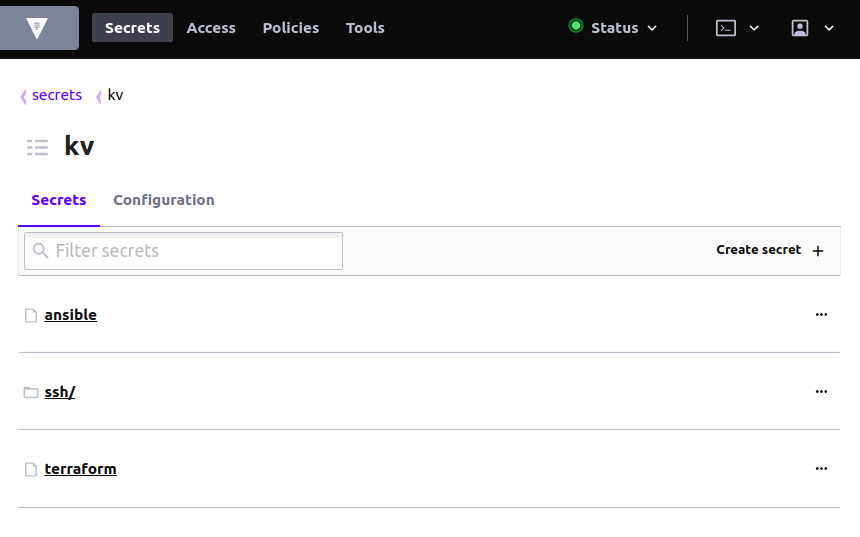
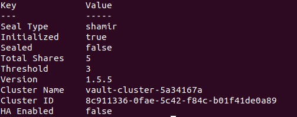
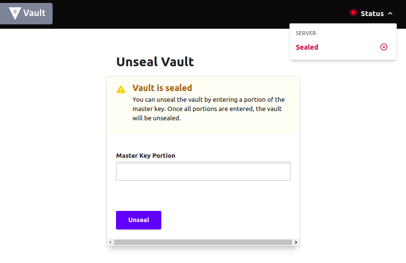
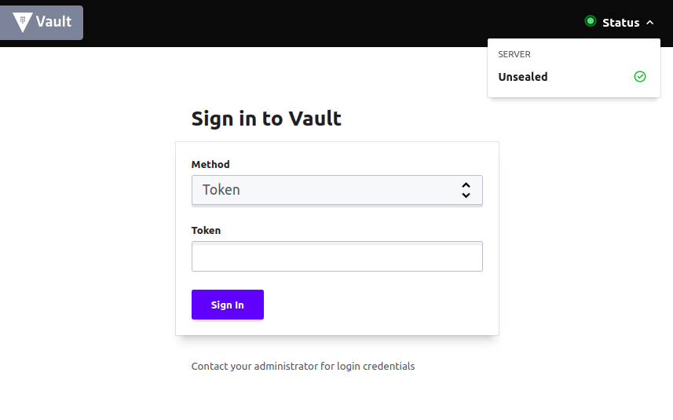
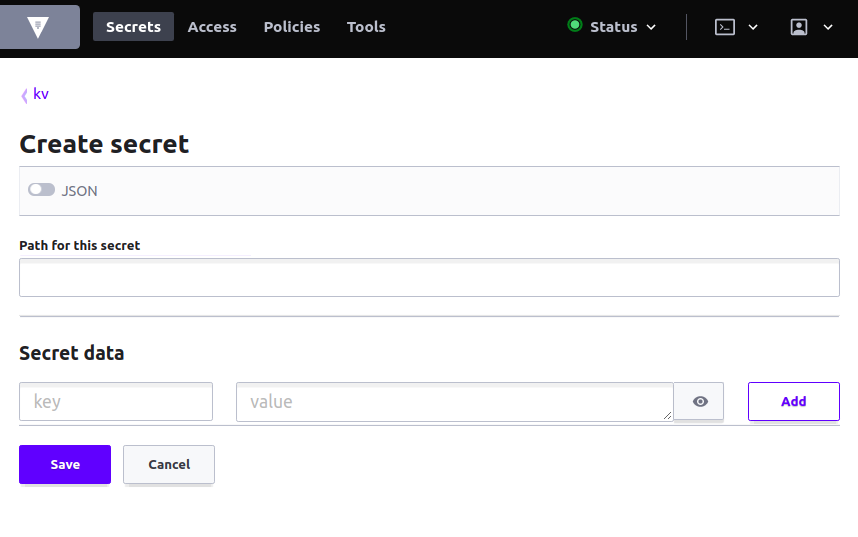

# HashiCorp_Vault
All about HashiCorp Vault

Brief explanation: <br>
**This is guide to create and using self-managed Hashicorp Vault for self-managed Secret Management. <br>
Currently utilized by Terraform and Ansible to retrieve secrets or credentials**. <br>
Vault Preview: <br> 



## Requirement
**VM Hardware:**
- OS = Ubuntu/CentOS **(Ubuntu for better update package)**
- CPU >= 1 CPU
- RAM >= 3.75 GB
- Disk >= 5 GB **(SSD for better performance)**
- Port: **8282,8283**

Depedency:
- Install Vault
- Install hvac (optional)

## Setup Guide
- For installation, follow hashicorp instruction from this
[link](https://learn.hashicorp.com/tutorials/vault/getting-started-install). <br>
Make sure to check if it already installed by execute:
```
    vault --version or vault -v
```

- Vault server allow for development mode but it running using in-memory as temporary storage,
to make it persistent, must run it on production mode and using configuration file as the setup.
This is the configuration file that work well:
```
    storage "file" {
      path = "/etc/vault.d/vault-data"
    }
    
    listener "tcp" {
      address       = "yourIP:8282"
      tls_disable = 1
    }
    
    api_addr = "http://yourIP:8282"
    cluster_addr = "http://yourIP:8283"
    ui = true
```

Fill the storage path anywhere, listener address is the VM IP address and the port free to change 
as long as not occupied by other services, ui for enabling GUI via browser just navigate to the 
IP address and port correctly.

- **Because starting vault server can't running in background mode by default, so needed run with nohup.
Nohup will make it running on background. Execute this to start vault server on background:**
```
    sudo nohup vault server -config=./vault-server.hcl &
```

Notice the config flag, make sure it navigate to the file location.

- Since the server running, every time interact with vault, vault will need to know with vault server it interact,
so it need to export variable and this is the default variable: 
```
    VAULT_ADDR=http://theIP:thePort
```

- Check the vault server is it already running well or not by execute this:
```
    vault status
```
Success preview be like this: <br>


NB: sealed is true means sealed, sealed is false means unseal

## Usage Guide
- **Since it the first time, needed to initialization to get vault token by execute:**
```
    vault operator init
```
**It will print out unseal key and root token, save it to anywhere cause that is the key to open vault everytime
vault in sealed mode. Not need to init as long as the token not revoked.**

- Now it time to use the Vault. Before start using it, it always on the seal mode that means needed to submit 3 of 5 
unseal key that given when initialization. Sealed preview be like this (GUI): <br>


If using command line, execute this 3 times and fill it with different unseal key 3 times too:
```
    vault operator unseal
```

After successfully unseal the vault, it preview be like this (GUI): <br>


- Enable secret engine which we need to save secrets or credentials but its format is key/value.
Execute this command:
```
    vault secrets enable kv -version=2
```
NB: Version flag is optional, by default is version 1. Version 2 have more feature that version 1 don't have.

- Insert secret to vault with this command:
```
    vault kv put kv/anythingyouwant yourkey=thevalue
```

Using GUI be like this: <br>


## Integration
### Terraform
- To use it with Terraform, need to add:
    - provider at provider.tf file
    ```
        provider "vault" {
            address = vault_address
            token = vault_token
        }  
    ```
    - data vault generic secret at main.tf file
    ```
        data "vault_generic_secret" "yourSecret" {
            path = secretPath
        }
    ```

### Ansible
- To use it with Ansible, need to install hvac by running:
```
    pip install hvac
```

- Then install community.general.hashi_vault by running:
```
    ansible-galaxy collection install community.general
```

- After it installed, use this method to retrieve secret:
```
    "{{ lookup('community.general.hashi_vault', 'secret=secretPath token=vault_token url=vault_address validate_certs=false') }}"
```
